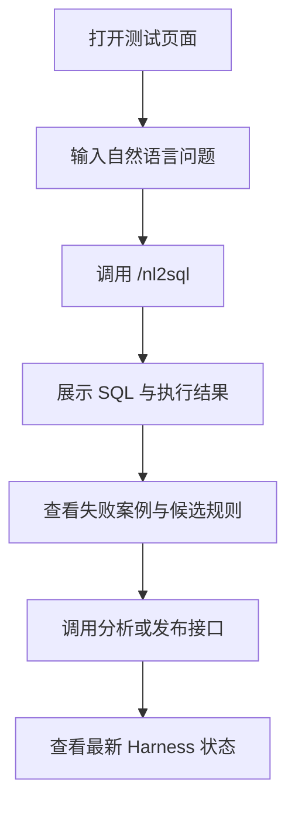

## 1. 产品概述
为 `MES NL2SQL` 服务提供一个可直接打开的前端测试页面，用于调试 `/nl2sql` 与线上 Harness 管理接口。
- 面向研发、测试、实施和算法调优人员，降低通过 Swagger 或命令行调接口的门槛。
- 目标是让一次请求的输入、输出、执行状态、失败案例、候选规则和发布结果都能被可视化查看。

## 2. 核心功能
### 2.1 用户角色
| 角色 | 进入方式 | 核心权限 |
|------|----------|----------|
| 研发/测试人员 | 直接打开测试页 | 调用 NL2SQL、查看执行结果、查看 Harness 数据 |

### 2.2 功能模块
1. **NL2SQL 调试区**：输入自然语言问题，调用 `/nl2sql`
2. **执行结果区**：展示 SQL、安全状态、错误、执行结果、命中知识版本
3. **Harness 观测区**：展示失败案例、候选规则、分析与发布结果
4. **快捷操作区**：一键刷新失败案例、候选规则、触发分析与发布

### 2.3 页面详情
| 页面名称 | 模块名称 | 功能描述 |
|-----------|-------------|---------------------|
| 测试页面 | 查询输入区 | 输入自然语言问题，快速发起 `/nl2sql` 请求 |
| 测试页面 | SQL 结果卡片 | 展示 SQL、表名、JOIN 提示、执行结果和错误信息 |
| 测试页面 | Harness 失败案例表格 | 查看 `/admin/harness/failure-cases` 返回结果 |
| 测试页面 | Harness 候选规则表格 | 查看 `/admin/harness/candidates` 返回结果 |
| 测试页面 | 运维操作面板 | 执行失败分析、发布知识版本并回显结果 |

## 3. 核心流程
用户打开测试页后，先输入一个查询问题并发起 `/nl2sql`，随后查看 SQL、执行结果和知识版本；如果结果异常，可切换到 Harness 区域查看失败案例和候选规则，并触发分析或发布动作。

## 4. 用户界面设计
### 4.1 设计风格
- 主色：深蓝黑、石墨灰、青绿色高亮
- 辅色：琥珀色警告、红色错误、绿色成功
- 按钮风格：圆角中等、玻璃态边框、强对比 hover
- 字体：标题使用有工业感的无衬线，正文使用清晰易读的系统无衬线
- 布局风格：桌面优先，双栏信息面板 + 数据表格
- 图标风格：使用 `lucide-react`，突出调试控制台氛围

### 4.2 页面设计概览
| 页面名称 | 模块名称 | UI 元素 |
|-----------|-------------|-------------|
| 测试页面 | 顶部头图 | 暗色背景、状态徽标、项目简介、接口状态提示 |
| 测试页面 | 查询输入区 | 多行输入框、预设问题按钮、执行按钮、加载态 |
| 测试页面 | SQL 结果卡片 | 代码块、状态标签、统计卡片、错误高亮 |
| 测试页面 | Harness 面板 | Tab、表格、滚动容器、刷新按钮、结果摘要 |

### 4.3 响应式
- 采用桌面优先设计
- 在窄屏下由双栏切换为纵向堆叠
- 长 SQL 和 JSON 区块使用内部滚动，避免页面过长
