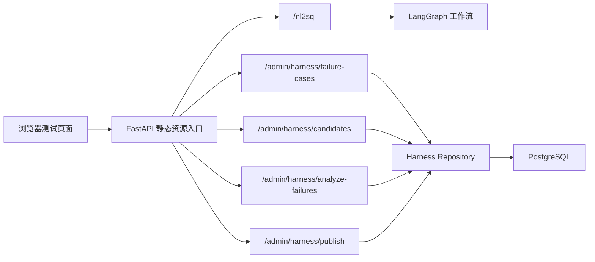
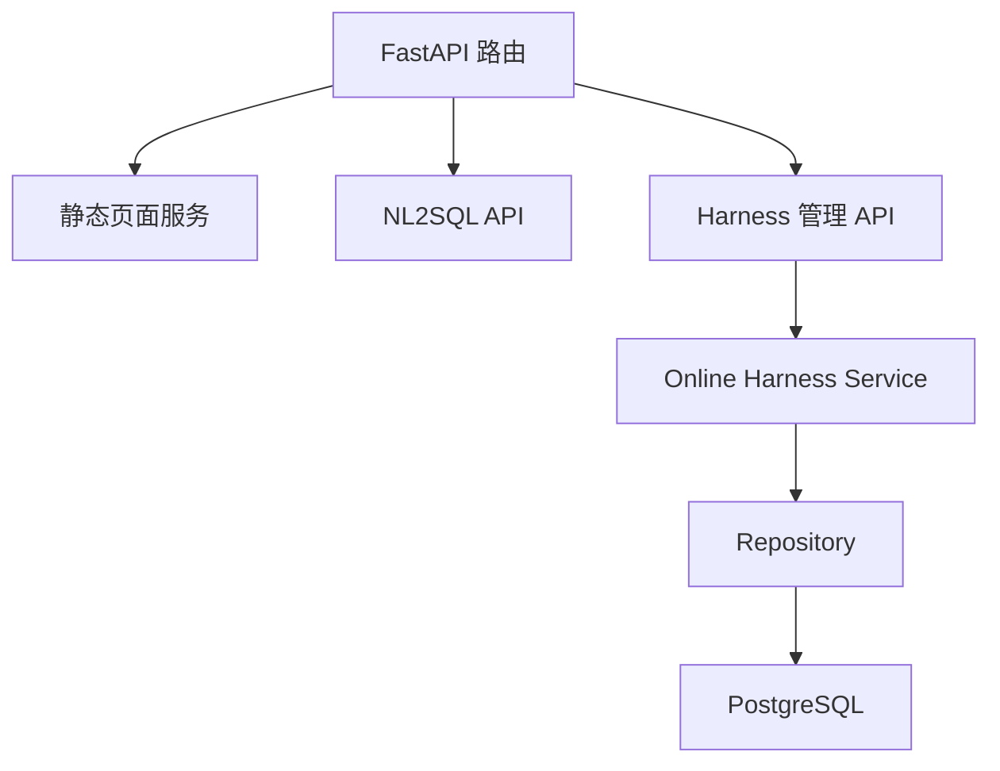
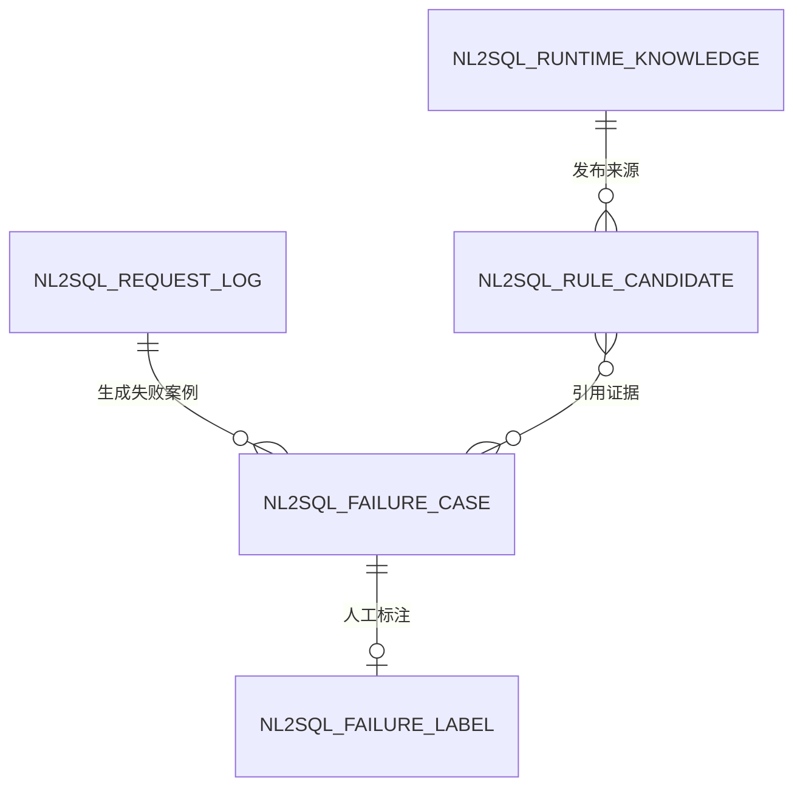

## 1. 架构设计


## 2. 技术说明
- 前端：React 18 + TypeScript + Vite + TailwindCSS
- 路由：单页路由，仅保留 `/`
- 状态管理：React 本地状态，页面内数据为测试态，无需全局 Zustand
- 后端：复用现有 FastAPI 服务，增加静态资源挂载
- 初始化工具：Vite React TypeScript 模板

## 3. 路由定义
| 路由 | 用途 |
|------|------|
| `/` | NL2SQL 测试与 Harness 管理页面 |

## 4. API 定义
```ts
type NL2SQLRequest = {
  query: string;
};

type NL2SQLResponse = {
  query: string;
  sql: string;
  safe: boolean;
  error: string;
  tables_used: string[];
  join_hints: string;
  execution_result?: Record<string, unknown> | null;
  retry_count: number;
  request_id: string;
  knowledge_version: string;
};

type HarnessFailureCase = {
  id: number;
  query_text: string;
  failure_type: string;
  status: string;
  error_text: string;
  retry_count: number;
  correct_sql?: string;
};

type HarnessCandidate = {
  id: number;
  candidate_type: string;
  status: string;
  question_example: string;
  confidence: number;
  review_note: string;
};
```

## 5. 服务端架构图


## 6. 数据模型
### 6.1 数据模型定义


### 6.2 数据定义说明
- 不新增业务数据库表
- 前端只消费现有 FastAPI 接口
- 页面静态资源打包到 `src/ui/` 对应的前端工程，并通过 FastAPI 挂载 `dist`
- 测试页只做调试与可视化，不引入鉴权和复杂后端改造
